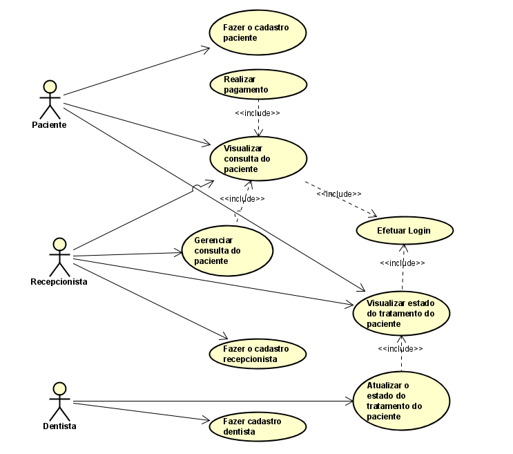

Projeto da disciplina de Métodos de projeto de software com o professor Raoni

Tema da equipe: Sistema de Acompanhamento Ortodôntico

	Equipe: Andre Lopes de Sousa e Oliveira,
	Ryan Duarte Sarmento Pedrosa,
	Vinicius Leite Ferreira Alves,
	Francisco Emmanuel Marcolino Lino Dos Santos

1 - Diagrama de caso de uso:

2 - Elaborem um diagrama de classe de análise (Fronteira, Entidade e Controle):
