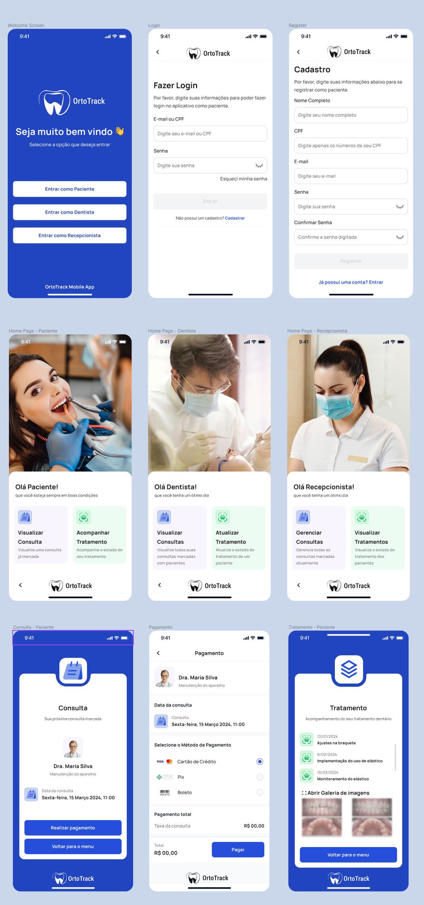

Projeto da disciplina de Métodos de projeto de software com o professor Raoni

Tema da equipe: Sistema de Acompanhamento Ortodôntico

	Equipe: 
	Andre Lopes de Sousa e Oliveira,
	Ryan Duarte Sarmento Pedrosa,
	Vinicius Leite Ferreira Alves,
	Francisco Emmanuel Marcolino Lino Dos Santos

Link do documento de requisitos: https://docs.google.com/document/d/19ApEQVG5AbntCo4Z4OvCfJrC70aX5jOUWo13hSR1gDY/edit

1 - Diagrama de Casos de Uso:

2 - Diagrama de Classe de Análise (Fronteira, Entidade e Controle):

3 - Descrição da interface com o usuário:

